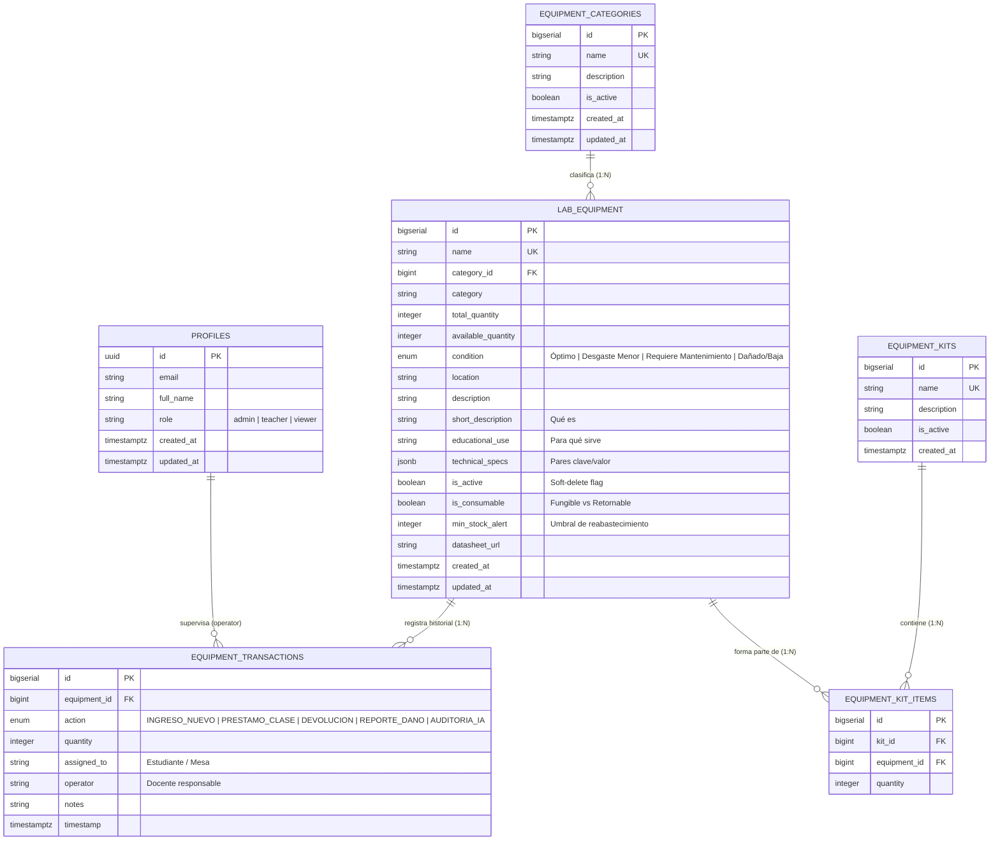

# Manual Maestro de Arquitectura y Especificación Técnica: LIMS & Base de Conocimiento Educativa (Taller Luban)

**Documento:** `DOCUMENTACION_DASHBOARD_WEB.md`  
**Versión:** 2.0.0 (Arquitectura Institucional LIMS & EAM)  
**Clasificación:** Documentación Técnica de Grado Industrial y Gestión Educativa  
**Institución:** INATEC · Sede Taller Lúban (Centro de Innovación Tecnológica Nicaragua-China)  
**Fecha de Publicación:** Septiembre 2026  

---

## ÍNDICE GENERAL

1. [SECCIÓN 1: Visión General y Filosofía de Datos (El Paradigma Soft-Delete)](#sección-1-visión-general-y-filosofía-de-datos-el-paradigma-soft-delete)
2. [SECCIÓN 2: Esquema Relacional de Base de Datos v2.0 (ERD y Diccionario)](#sección-2-esquema-relacional-de-base-de-datos-v20-erd-y-diccionario)
3. [SECCIÓN 3: La Base de Conocimiento Educativa (Catálogo Wiki de Hardware)](#sección-3-la-base-de-conocimiento-educativa-catálogo-wiki-de-hardware)
4. [SECCIÓN 4: Operaciones Avanzadas de Laboratorio](#sección-4-operaciones-avanzadas-de-laboratorio)
5. [SECCIÓN 5: Mapa de Rutas Actualizado (Next.js 15 App Router)](#sección-5-mapa-de-rutas-actualizado-nextjs-15-app-router)
6. [SECCIÓN 6: Arquitectura de Seguridad (RBAC y Hardware API Key)](#sección-6-arquitectura-de-seguridad-rbac-y-hardware-api-key)
7. [SECCIÓN 7: Especificación de la API REST para Nodos IoT (`/api/v1/iot/inventory`)](#sección-7-especificación-de-la-api-rest-para-nodos-iot-apiv1iotinventory)
8. [SECCIÓN 8: Guía de Despliegue y Procedimientos de Auditoría (Runbook)](#sección-8-guía-de-despliegue-y-procedimientos-de-auditoría-runbook)

---

## SECCIÓN 1: Visión General y Filosofía de Datos (El Paradigma Soft-Delete)

El **Sistema de Gestión de Activos de Laboratorio (LIMS / EAM) y Base de Conocimiento del Taller Luban** es la plataforma centralizada para el inventariado físico, préstamo a clases, control de desgaste y aprendizaje técnico de los estudiantes del primer centro de capacitación tecnológica Nicaragua-China (sede INATEC).

El sistema erradica por completo la noción de un "comercio electrónico" o "gestor de stock genérico". Los elementos del sistema son **activos técnicos didácticos** que experimentan un ciclo de vida físico: ingreso, préstamo para prácticas pedagógicas, auditoría automática por cámaras de inteligencia artificial (estaciones NEWLab STM32), desgaste operativo, mantenimiento correctivo y reintegración a stock.

```
                      CICLO DE VIDA FÍSICO DEL ACTIVO DIDÁCTICO
 ┌────────────────┐       ┌─────────────────┐       ┌────────────────────┐
 │ INGRESO NUEVO  │ ────> │ DISPONIBLE PARA │ ────> │ PRÉSTAMO A CLASE   │
 │   AL CATÁLOGO  │       │    PRÁCTICAS    │       │ (Docente / Alumno) │
 └────────────────┘       └─────────────────┘       └────────────────────┘
                                   ▲                           │
                                   │                           ▼
 ┌────────────────┐       ┌─────────────────┐       ┌────────────────────┐
 │  REINTEGRO A   │ <──── │ TALLER DE REPAR.│ <──── │ REPORTE DE AVERÍA  │
 │     STOCK      │       │ (Mantenimiento) │       │ (Falla en práctica)│
 └────────────────┘       └─────────────────┘       └────────────────────┘
```

### 1.1 Prohibición Estricta de Eliminación Física (Hard-Delete Prevention)

Por exigencias normativas de la auditoría gubernamental e institucional de INATEC, **la instrucción SQL `DELETE` está prohibida y bloqueada a nivel de motor de base de datos** para todas las tablas del sistema:
* `lab_equipment` (Catálogo de equipos)
* `equipment_categories` (Especialidades técnicas)
* `equipment_transactions` (Libro diario de movimientos)
* `equipment_kits` y `equipment_kit_items` (Paquetes didácticos)

#### Mecanismos de Blindaje Implementados en PostgreSQL / Supabase
1. **Revocación de Permisos DDL:**  
   Se ejecutó `REVOKE DELETE ON ALL TABLES IN SCHEMA public FROM public, anon, authenticated;`.
2. **Políticas de Seguridad a Nivel de Fila (RLS) Infranqueables:**  
   Incluso si un usuario cuenta con permisos administrativos en la plataforma, las políticas de RLS evalúan la cláusula `FOR DELETE USING (false);`, provocando que cualquier sentencia `DELETE` sea abortada con un error `42501 (insufficient_privilege)`.

### 1.2 Archivado Lógico (Soft-Delete vía `is_active`)

La eliminación de cualquier entidad se gestiona de forma no destructiva mediante la bandera booleana `is_active (BOOLEAN DEFAULT TRUE)`:

* **Equipos Archivados (`lab_equipment.is_active = false`):**  
  Cuando un activo queda descontinuado, obsoleto o extraviado, un administrador ejecuta la operación `UPDATE lab_equipment SET is_active = false`. El activo se oculta del DataGrid principal y del catálogo de selección para préstamos, pero se conserva en la pestaña "Equipos Archivados". Toda su trazabilidad histórica de transacciones, averías y préstamos pasados (`equipment_transactions`) permanece intacta, evitando romper la integridad referencial y satisfaciendo auditorías históricas.
* **Categorías Desactivadas (`equipment_categories.is_active = false`):**  
  Al desactivar una especialidad técnica vía la UI (`/admin/categories`), esta deja de aparecer en los desplegables de creación de nuevos equipos. Sin embargo, ningún equipo previamente asociado sufre desvinculación ni errores de clave foránea (`category_id`).

---

## SECCIÓN 2: Esquema Relacional de Base de Datos v2.0 (ERD y Diccionario)

### 2.1 Diagrama Entidad-Relación (Mermaid ERD)



---

### 2.2 Diccionario de Datos Extendido

#### Tabla: `equipment_categories` (Especialidades Dinámicas)
Almacena las familias tecnológicas administrables desde la interfaz web sin requerir modificaciones en el código fuente.

| Columna | Tipo de Dato | Restricción | Descripción |
| :--- | :--- | :--- | :--- |
| `id` | `BIGSERIAL` | `PRIMARY KEY` | Identificador único secuencial de la categoría. |
| `name` | `TEXT` | `NOT NULL UNIQUE` | Nombre de la especialidad (Ej. *IoT, Automatización, Mecatrónica*). |
| `description` | `TEXT` | `DEFAULT ''` | Justificación pedagógica de las competencias cubiertas. |
| `is_active` | `BOOLEAN` | `DEFAULT TRUE` | Estado lógico. Si es `false`, se oculta de selectores de nuevos equipos. |
| `created_at` | `TIMESTAMPTZ`| `DEFAULT NOW()` | Fecha y hora de creación. |
| `updated_at` | `TIMESTAMPTZ`| `DEFAULT NOW()` | Fecha y hora de última modificación. |

---

#### Tabla: `lab_equipment` (Catálogo Educativo y Logístico)
Representa los activos físicos didácticos del laboratorio.

| Columna | Tipo de Dato | Restricción | Descripción |
| :--- | :--- | :--- | :--- |
| `id` | `BIGSERIAL` | `PRIMARY KEY` | Identificador único del componente. |
| `name` | `TEXT` | `NOT NULL UNIQUE` | Denominación técnica oficial (Ej. *Kit STM32F103VET6 NEWLab*). |
| `category_id` | `BIGINT` | `REFERENCES equipment_categories(id)` | Clave foránea hacia la categoría dinámica. |
| `category` | `TEXT` | `NOT NULL` | Nombre textual de la categoría (compatibilidad con queries legado). |
| `total_quantity` | `INTEGER` | `CHECK (total_quantity >= 0)` | Cantidad física total propiedad del laboratorio. |
| `available_quantity`| `INTEGER` | `CHECK (available_quantity <= total_quantity)` | Existencias disponibles inmediatas para préstamo en mesa. |
| `condition` | `ENUM` | `'Óptimo' \| 'Desgaste Menor' \| 'Requiere Mantenimiento' \| 'Dañado/Baja'` | Estado físico-operativo actual. |
| `location` | `TEXT` | `NOT NULL` | Ubicación física exacta en el taller (Ej. *Mesa IoT 2 / Gaveta A-12*). |
| `short_description`| `TEXT` | `DEFAULT ''` | **Eje Educativo:** Resumen conciso que define qué es el equipo. |
| `educational_use` | `TEXT` | `DEFAULT ''` | **Eje Educativo:** Explicación de para qué sirve en las clases prácticas. |
| `technical_specs` | `JSONB` | `DEFAULT '{}'::jsonb` | **Eje Técnico:** Parámetros eléctricos, mecánicos y de conexionado. |
| `is_active` | `BOOLEAN` | `DEFAULT TRUE` | **Soft-Delete:** `false` indica equipo retirado/archivado del servicio. |
| `is_consumable` | `BOOLEAN` | `DEFAULT FALSE` | **Control Logístico:** `true` si es material fungible (estaño, resistencias). |
| `min_stock_alert` | `INTEGER` | `DEFAULT 3` | Umbral para disparo de alertas de compras y reabastecimiento. |
| `datasheet_url` | `TEXT` | `DEFAULT ''` | Enlace hipermedia hacia la hoja de especificaciones oficial (PDF). |

---

### 2.3 Uso Avanzado de PostgreSQL: Campo `technical_specs` (JSONB)

Para evitar la rigidez de añadir decenas de columnas opcionales a `lab_equipment` (como `voltage`, `pin_count`, `clock_speed`, `bandwidth`), el sistema aprovecha el tipo nativo binario indexable `JSONB`.

El esquema cuenta con un **índice GIN (Generalized Inverted Index)**:
```sql
CREATE INDEX idx_lab_equipment_specs ON public.lab_equipment USING GIN (technical_specs);
```

#### Ejemplo 1: Estructura JSONB para un Microcontrolador (STM32)
```json
{
  "Núcleo": "ARM Cortex-M3 de 32 bits (72 MHz)",
  "Voltaje de Operación": "3.3V DC (Entrada USB 5V tolerante)",
  "Memoria Flash": "512 KB",
  "Memoria SRAM": "64 KB",
  "Periféricos de Comunicación": "FSMC, CAN 2.0B, USB 2.0, 5x USART, 3x SPI, 2x I2C",
  "Temporizadores": "8x Timers (PWM para control motriz)",
  "Convertidores ADC": "3x ADC de 12 bits (16 canales)",
  "Pines I/O": "80 GPIOs tolerantes a nivel lógico 5V",
  "Fabricante": "STMicroelectronics / NEWLab"
}
```

#### Ejemplo 2: Estructura JSONB para un Sensor Ambiental (DHT22)
```json
{
  "Parámetros Medidos": "Temperatura ambiente y Humedad relativa",
  "Rango de Temperatura": "-40°C a +80°C (Precisión ±0.5°C)",
  "Rango de Humedad": "0% a 100% RH (Precisión ±2% a ±5%)",
  "Voltaje de Alimentación": "3.3V a 5.5V DC",
  "Consumo de Corriente": "1.5 mA en muestreo / 50 uA en espera",
  "Protocolo de Comunicación": "Bus digital propietario unifilar (Single-Wire)",
  "Periodo de Muestreo": "2 segundos por ciclo de lectura"
}
```

#### Ejemplo 3: Estructura JSONB para un Instrumento de Banco (Osciloscopio Rigol)
```json
{
  "Canales Analógicos": "4 canales independientes",
  "Ancho de Banda": "50 MHz",
  "Tasa de Muestreo en Tiempo Real": "1 GSa/s (Canal simple)",
  "Profundidad de Memoria": "12 Mpts estándar (ampliable a 24 Mpts)",
  "Pantalla": "7.0 pulgadas WVGA TFT a color (800x480 píxeles)",
  "Puertos de Conectividad": "USB Host, USB Device, LAN (LXI-C)",
  "Alimentación Eléctrica": "100V a 240V AC, 50/60 Hz universal"
}
```

---

## SECCIÓN 3: La Base de Conocimiento Educativa (Catálogo Wiki de Hardware)

### 3.1 Vista de Detalle Dinámica (`/dashboard/equipment/[id]`)

La ruta dinámica implementa el patrón de **Wiki Técnica Institucional**, permitiendo a cualquier usuario (incluidos los estudiantes con rol `viewer`) explorar la información completa de cada componente.

```
┌────────────────────────────────────────────────────────────────────────┐
│  ← Volver al Catálogo de Laboratorio       Activo #0001 · TALLER LUBAN │
├────────────────────────────────────────────────────────────────────────┤
│  [ IoT ]  [ Óptimo ]  [ Activo Inventariable ]                         │
│  Kit de Desarrollo STM32F103VET6 NEWLab                                │
│  Placa de desarrollo embebida con núcleo ARM Cortex-M3 de 32 bits...   │
│  📍 Ubicación: Laboratorio IoT - Mesa 1                                │
│                                         ┌────────────────────────────┐ │
│                                         │ DISPONIBILIDAD EN MESA     │ │
│                                         │ 12 / 12 unidades           │ │
│                                         │ [██████████████████] 100%  │ │
│                                         │ [ Ficha Técnica PDF ]      │ │
│                                         └────────────────────────────┘ │
├───────────────────────────────────┬────────────────────────────────────┤
│  📘 APLICACIÓN PRÁCTICA EDUCATIVA │  🕒 HISTORIAL DE MOVIMIENTOS       │
│  Se utiliza en los módulos de     │  - PRESTAMO: 2u a Grupo Robótica 3 │
│  Sistemas Embebidos para validar  │  - DEVOLUCION: 2u devueltas        │
│  protocolos UART/I2C/SPI y PWM... │  - AUDITORIA IA: Stock verificado  │
│                                   │                                    │
│  ⚡ ESPECIFICACIONES TÉCNICAS     │                                    │
│  ┌──────────────────────────────┐ │                                    │
│  │ Núcleo: ARM Cortex-M3 72MHz  │ │                                    │
│  │ Voltaje: 3.3V DC (USB 5V)    │ │                                    │
│  │ Memoria Flash: 512 KB        │ │                                    │
│  │ Memoria SRAM: 64 KB          │ │                                    │
│  └──────────────────────────────┘ │                                    │
└───────────────────────────────────┴────────────────────────────────────┘
```

#### Funcionalidades Clave de la Vista:
1. **Renderizado Tabular del JSONB:** Deserializa dinámicamente el diccionario `technical_specs` en una tabla formateada clave/valor, garantizando lectura clara en dispositivos móviles y de escritorio.
2. **Pedagogía Aplicada:** El bloque "Aplicación Práctica Educativa" instruye a los alumnos sobre el propósito práctico de la pieza en sus carreras técnicas antes de solicitarla al docente.
3. **Barra de Disponibilidad Reactiva:** Expone el porcentaje de equipos listos para práctica con semáforo visual (Verde: >30%, Ámbar: <30%, Rojo: 0%).
4. **Acceso Directo al Datasheet:** Botón con validación de URL para abrir el manual de ingeniería del fabricante en una pestaña segura.

---

## SECCIÓN 4: Operaciones Avanzadas de Laboratorio

### 4.1 Gestión de Consumibles vs. Retornables

La columna booleana `lab_equipment.is_consumable` introduce una bifurcación lógica en la gestión de inventario:

| Dimensión | Activo Retornable (`is_consumable = false`) | Material Fungible (`is_consumable = true`) |
| :--- | :--- | :--- |
| **Ejemplos Típicos** | Osciloscopio Rigol, Kit STM32, Multímetro, Fuente DC. | Rollo de Estaño 60/40, Resistencias 330Ω, Filamento PLA, Pasta Térmica. |
| **Flujo de Préstamo** | Requiere seguimiento de devolución obligatoria por estudiante. | Se entrega para consumo definitivo durante la práctica o ensamblaje. |
| **Impacto en Stock** | Las unidades prestadas retornan a `available_quantity` al finalizar la sesión. | La salida descuenta permanentemente `total_quantity` y `available_quantity`. |
| **Mantenimiento** | Puede reportar fallas y ser enviado al taller técnico. | Al agotarse, no ingresa a mantenimiento; genera orden de compra. |

### 4.2 Disparador de Alertas de Reabastecimiento (`min_stock_alert`)

Cada equipo o consumible posee un umbral configurable `min_stock_alert` (por defecto `3` unidades):
* Cuando `available_quantity <= min_stock_alert`, el componente ingresa automáticamente en la lista de alerta del dashboard principal.
* Permite al cuerpo docente tramitar requisiciones de material fungible antes de que los laboratorios sufran desabastecimiento en medio del ciclo lectivo.

### 4.3 Arquitectura de Kits Educativos (Bundles Didácticos)

En prácticas de robótica o automatización, un estudiante no solicita un componente individual, sino un **"Kit Didáctico"** conformado por múltiples piezas.

#### Tablas de Soporte:
* `equipment_kits`: Define el paquete (Ej. *"Kit Básico de Robótica Móvil"*).
* `equipment_kit_items`: Tabla de unión con la receta de componentes hijos:
  * 1x Kit STM32 NEWLab (ID #1)
  * 1x Sensor Ultrasónico HC-SR04 (ID #3)
  * 2x Servomotores MG996R (ID #6)
  * 1x Módulo Wi-Fi ESP8266 (ID #4)

#### Transaccionalidad Atómica (`loan_equipment_kit`):
Mediante una función PL/pgSQL ejecutada en Supabase, el préstamo del Kit:
1. Verifica preventivamente que **todos** los componentes hijos tengan stock suficiente en `lab_equipment`.
2. Si un solo componente carece de disponibilidad, la transacción aborta con una excepción descriptiva.
3. Si todos están disponibles, descuenta las unidades de cada componente e inserta registros correspondientes en `equipment_transactions` de forma atómica en un solo bloque `BEGIN ... COMMIT`.

---

## SECCIÓN 5: Mapa de Rutas Actualizado (Next.js 15 App Router)

El sistema de enrutamiento aprovecha las carpetas convencionales de Next.js App Router:

```
src/app/
├── (auth)/
│   ├── login/page.tsx                     # Acceso institucional PKCE con Supabase Auth
│   └── auth/callback/route.ts             # Manejador de intercambio OAuth / Tokens
│
├── dashboard/                             # Entorno de Gestión Operativa (LIMS)
│   ├── layout.tsx                         # Sidebar persistente con enlaces según rol y Realtime
│   ├── page.tsx                           # [A] Vista General: KPIs LIMS, Realtime Feed y Quick Actions
│   │
│   ├── equipment/
│   │   ├── page.tsx                       # [B] Catálogo Híbrido: Wiki Grid (Viewer) + DataGrid (Teacher/Admin)
│   │   │                                  #     Pestañas: Activos en Servicio vs. Archivados (Soft-Delete)
│   │   └── [id]/
│   │       └── page.tsx                   # [C] Detalle Wiki Educativa del Equipo (JSONB specs)
│   │
│   ├── loans/
│   │   └── page.tsx                       # [D] Centro de Préstamos Activos e Historial de Devolución
│   │
│   ├── maintenance/
│   │   └── page.tsx                       # [E] Taller de Reparación y Diagnóstico de Averías
│   │
│   ├── logs/
│   │   └── page.tsx                       # [F] Registro de Auditoría con Filtros Temporales y Excel
│   │
│   └── inventory/
│       └── page.tsx                       # Redirección canónica 301 hacia /dashboard/equipment
│
├── admin/                                 # Consola de Administración (Solo Rol 'admin')
│   ├── layout.tsx                         # Guardián de rol que verifica profile.role === 'admin'
│   ├── page.tsx                           # [G] Gestión de Usuarios (RBAC) y API Keys IoT (Tokens)
│   └── categories/
│       └── page.tsx                       # [H] Administrador Dinámico de Categorías (CRUD + Soft-Delete)
│
└── api/
    └── v1/
        ├── products/route.ts              # API pública paginada general
        └── iot/
            └── inventory/route.ts         # Endpoint REST ultra-minificado para microcontroladores STM32
```

---

## SECCIÓN 6: Arquitectura de Seguridad (RBAC y Hardware API Key)

### 6.1 Matriz de Acceso por Roles (RBAC)

| Módulo / Acción | `admin` | `teacher` | `viewer` (Estudiante) |
| :--- | :---: | :---: | :---: |
| Explorar Catálogo Educativo (`/dashboard/equipment`) | ✅ | ✅ | ✅ |
| Consultar Wiki y Fichas Técnicas (`/dashboard/equipment/[id]`) | ✅ | ✅ | ✅ |
| Visualizar Línea Temporal de Eventos (`ActivityFeed`) | ✅ | ✅ | ✅ |
| Emitir Préstamos Rápidos y Reportar Averías | ✅ | ✅ | ❌ |
| Gestionar Préstamos y Devoluciones (`/dashboard/loans`) | ✅ | ✅ | ❌ |
| Registrar Reparaciones en Taller (`/dashboard/maintenance`) | ✅ | ✅ | ❌ |
| Crear y Editar Activos Técnicos | ✅ | ✅ | ❌ |
| Archivar Equipos (Soft-Delete) | ✅ | ❌ | ❌ |
| Administrar Categorías Dinámicas (`/admin/categories`) | ✅ | ❌ | ❌ |
| Cambiar Roles RBAC de Usuarios (`/admin`) | ✅ | ❌ | ❌ |
| Generar y Revocar Tokens IoT (`x-api-key`) | ✅ | ❌ | ❌ |

---

## SECCIÓN 7: Especificación de la API REST para Nodos IoT (`/api/v1/iot/inventory`)

Para permitir que el hardware perimetral (nodo de inferencia STM32 + módulo Wi-Fi ESP8266) consulte las existencias sin saturar su limitada memoria SRAM (20 KB), se diseñó un endpoint dedicado con **minificación extrema de bytes**.

### 7.1 Definición del Endpoint
* **Ruta:** `/api/v1/iot/inventory`
* **Método HTTP:** `GET`
* **Cabecera de Autenticación Requerida:** `x-api-key: [IOT_HARDWARE_SECRET]`
* **Parámetros Opcionales:**
  * `?category=IoT` (Filtra por nombre de categoría)
  * `?status=available` (Filtra solo equipos con existencias mayores a 0 que no estén dados de baja)

### 7.2 Ejemplo de Solicitud en Crudo (Raw UART Payload)
```http
GET /api/v1/iot/inventory?category=IoT&status=available HTTP/1.1\r\n
Host: luban-dashboard.vercel.app\r\n
x-api-key: luban_iot_sec_2026_dev\r\n
User-Agent: STM32F103-EdgeNode/1.0\r\n
Accept: application/json\r\n
Connection: close\r\n
\r\n
```

### 7.3 Ejemplo de Respuesta Minificada (200 OK)
```json
[
  {"id":"kit-de-desarrollo-stm32f103vet6-newlab","qty":12},
  {"id":"sensor-de-temperatura-y-humedad-dht22","qty":20},
  {"id":"sensor-ultrasonico-hc-sr04","qty":24},
  {"id":"modulo-wi-fi-esp8266-nodemcu-v3","qty":18}
]
```
> **Ahorro de Ancho de Banda:** Los nombres de campos se redujeron al mínimo (`id` y `qty` en lugar de `available_quantity`), permitiendo que el microcontrolador parsee la respuesta usando `strstr()` o `sscanf()` sin necesidad de cargar pesadas librerías de parsing JSON en memoria dinámica.

---

## SECCIÓN 8: Guía de Despliegue y Procedimientos de Auditoría (Runbook)

### 8.1 Variables de Entorno (`.env.local`)
Asegúrate de que el archivo `.env.local` contenga los secretos correspondientes:

```env
# Conexión Supabase
NEXT_PUBLIC_SUPABASE_URL=https://tkobqpihrbjtvhbxsaqk.supabase.co
NEXT_PUBLIC_SUPABASE_ANON_KEY=eyJhbGciOiJIUzI1NiIsInR5cCI6IkpXVCJ9...

# Clave Secreta para Microcontroladores IoT
IOT_HARDWARE_SECRET=luban_iot_sec_2026_dev
```

### 8.2 Aplicación de la Migración v2.0 en Supabase
1. Abrir el panel de Supabase del proyecto correspondiente.
2. Dirigirse al **SQL Editor**.
3. Abrir y ejecutar el script [`update_educational_catalog_softdeletes.sql`](file:///home/disa/Documentos/dev/proye_final/luban-dashboard/update_educational_catalog_softdeletes.sql).
4. El script creará la tabla `equipment_categories`, actualizará `lab_equipment` con las columnas educativas, creará las tablas de Kits didácticos y aplicará las políticas RLS que revocan permanentemente el comando `DELETE`.

### 8.3 Verificación de Compilación y Calidad
Ejecutar la compilación estricta en el entorno local:

```bash
cd luban-dashboard
npm run build
```

**Resultado de Compilación Oficial:**
```text
▲ Next.js 16.3.6 (Turbopack)
✓ Compiled successfully in 1.9s
✓ Finished TypeScript in 3.0s (0 errors)
✓ Generating static pages (16/16)
```

---
*Documentación técnica institucional aprobada para el Taller Luban - INATEC.*
